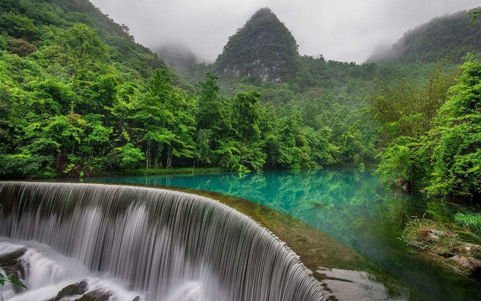

### November 2017

Central Myanmar Basin (Chindwin subbasin & Minbu subbasin) – organized by Myanmar Paleoclimte and Geodynamics research group (MyaPGR) led by Dr. LICHT Alexis.

### December 2016	

Central Myanmar Basin (Chindwin subbasin) – organized by Myanmar Paleoclimte and Geodynamics research group (MyaPGR) led by Dr. LICHT Alexis.

### May 2016

Northwest Yunnan (Lijiang & Dali), China – organized by Paleoecology Research Group, Key Laboratory of Tropical Forest Ecology, Xishuangbanna Tropical Botanical Garden, Chinese Academy of Sciences led by Professor ZHOU Zhekun.

### September 2015

South Yunnan (Jinggu), China – organized by Paleoecology Research Group, Key Laboratory of Tropical Forest Ecology, Xishuangbanna Tropical Botanical Garden, Chinese Academy of Sciences led by Professor ZHOU Zhekun.

### August 2015

West, central and southeast Yunnan (Heqing, Lvhe, Wenshan & Maguan), China – organized by Paleoecology Research Group, Key Laboratory of Tropical Forest Ecology, Xishuangbanna Tropical Botanical Garden, Chinese Academy of Sciences led by Professor ZHOU Zhekun.

### May & June 2015

East Tibet (Changdu District) and southern Sichuan (Xiangcheng), China – organized by Paleoecology Research Group, Key Laboratory of Tropical Forest Ecology, Xishuangbanna Tropical Botanical Garden, Chinese Academy of Sciences led by Professor ZHOU Zhekun.

### April 2015

Central Yunnan (Lvhe), China – organized by Paleoecology Research Group, Key Laboratory of Tropical Forest Ecology, Xishuangbanna Tropical Botanical Garden, Chinese Academy of Sciences led by Professor ZHOU Zhekun.

### January 2015

Central and southwest Yunnan (Lvhe, Baoshan, Dehong & Lincang), China – organized by Paleoecology Research Group, Key Laboratory of Tropical Forest Ecology, Xishuangbanna Tropical Botanical Garden, Chinese Academy of Sciences led by Professor ZHOU Zhekun.

### December 2014

East, central and northwest Yunnan (Qujing, Lvhe, Heqing & Shangri-la), China – organized by Paleoecology Research Group, Key Laboratory of Tropical Forest Ecology, Xishuangbanna Tropical Botanical Garden, Chinese Academy of Sciences led by Professor ZHOU Zhekun.

### October & November 2014

Northwest Yunnan (Dali, Lijiang & Shangri-la), China – organized by Paleoecology Research Group, Key Laboratory of Tropical Forest Ecology, Xishuangbanna Tropical Botanical Garden, Chinese Academy of Sciences led by Professor ZHOU Zhekun.

