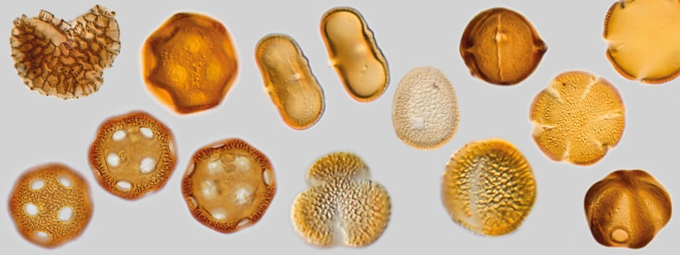

### Palynology

Pollen morphology in Eocene – Oligocene Central Myanmar Basin

-----------------

### Paleobotany

Fossil leaf architecture and cuticular analysis

-----------------

### Languages

Mandarin and Leizhouhua (native languages), Cantonese (fluent), English (fluent)
